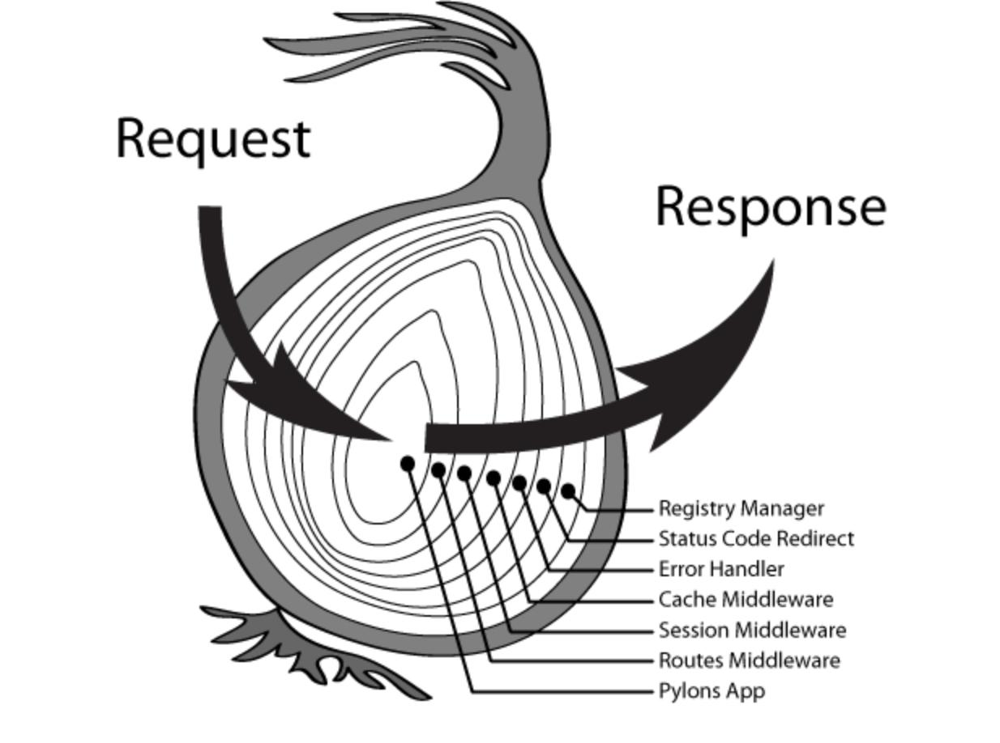

# Koa 基础

## 介绍

- 官网：https://koajs.com
- GitHub 仓库：https://github.com/koajs/koa
- 翻译中文网站：https://koa.bootcss.com
- awesome koa: https://github.com/ellerbrock/awesome-koa

## 基本用法

- 按照 koa

```powershell
npm install koa
```

> Koa 依赖 node v7.6.0 或 ES2015 及更高版本和 async 方法支持。

- app.js

```js
const Koa = require("koa");
const app = new Koa();

app.use(async ctx => {
  ctx.body = "Hello World";
});

app.listen(3000);
```

- Koa 应用程序是一个包含一组中间件函数的对象
- 它是按照类似堆栈的方式组织和执行的
- Koa 内部没有捆绑任何中间件，甚至是路由功能

## context 上下文对象

参见： https://koa.bootcss.com/#context

## 路由

### 原生路由

网站一般都有多个页面。通过 ctx.request.path 可以获取用户请求的路径，由此实现简单的路由。

```js
app.use(ctx => {
  const path = ctx.path;
  if (path === "/") {
    ctx.body = "home page";
  } else if (path === "/foo") {
    ctx.body = "foo page";
  } else {
    ctx.body = "404 Not Found";
  }
});
```

### koa-router 模块

原生路由用起来不太方便，我们可以使用封装好的 [koa-router](https://github.com/koajs/router) 模块。

- Express 路由风格（app.get、app.put、app.post ...）
- 命名动态 URL 参数
- 具有 URL 生成的命名路由
- 使用允许的请求方法响应 OPTIONS 请求
- 支持 405 和 501 响应处理
- 支持多路由中间件
- 支持多个嵌套的路由中间件
- 支持 async/awai 语法

安装：

```powershell
npm install @koa/router
```

```js
const Koa = require("koa");
const Router = require("@koa/router");

const app = new Koa();

const router = new Router();

router.get("/", ctx => {
  ctx.body = "home page";
});
router.post("/", ctx => {
  ctx.body = "post /";
});
router.get("/foo", ctx => {
  ctx.body = "foo page";
});
router.get("/users/:id", ctx => {
  console.log(ctx.params);
  ctx.body = "users page";
});

app.use(router.routes()).use(router.allowedMethods());

app.listen(3000);
```

### 静态资源托管

如果网站提供静态资源（图片、字体、样式表、脚本......），为它们一个个写路由就很麻烦，也没必要。[koa-static](https://github.com/koajs/static) 模块封装了这部分的请求。

- 安装：

```powershell
npm install koa-static
```

```js
/**
 * 配置路由
 */

const Koa = require("koa");

const static = require("koa-static");
const path = require("path");
const app = new Koa();

// app.use(static("./public"));
app.use(static(path.join(__dirname, "./public")));

app.listen(3000);
```

#### 给静态资源设置虚拟路径

使用 Koa 提供的 [koa-mount](https://github.com/koajs/mount) 。

### 重定向

有些场合，服务器需要重定向（redirect）访问请求。比如，用户登陆以后，将他重定向到登陆前的页面。ctx.response.redirect()方法可以发出一个 302 跳转，将用户导向另一个路由。

```js
router.get("/bar", ctx => {
  // 重定向针对的同步请求
  ctx.redirect("/foo");
});
```

## 中间件

Koa 的最大特色，也是最重要的一个设计，就是中间件（middleware）。



- 多个中间件会形成一个栈结构（middle stack），以"先进后出"（first-in-last-out）的顺序执行。
- 最外层的中间件首先执行。
- 调用 next 函数，把执行权交给下一个中间件。
- ...
- 最内层的中间件最后执行。
- 执行结束后，把执行权交回上一层的中间件。
- ...
- 最外层的中间件收回执行权之后，执行 next 函数后面的代码。

中间件栈结构示例如下：

```js
const one = (ctx, next) => {
  console.log(">> one");
  next();
  console.log("<< one");
};

const two = (ctx, next) => {
  console.log(">> two");
  next();
  console.log("<< two");
};

const three = (ctx, next) => {
  console.log(">> three");
  next();
  console.log("<< three");
};

app.use(one);
app.use(two);
app.use(three);
```

如果中间件内部没有调用 next 函数，那么执行权就不会传递下去。作为练习，你可以将 two 函数里面 next() 这一行注释掉再执行，看看会有什么结果。

### 异步中间件

如果有异步操作（比如读取数据库），中间件就必须写成 async 函数。

```js
app.use(async (ctx, next) => {
  const data = await util.promisify(fs.readFile)("./views/index.html");
  ctx.type = "html";
  ctx.body = data;
});
```

上面代码中，fs.readFile 是一个异步操作，必须写成 await fs.readFile()，然后中间件必须写成 async 函数。

### 中间件的合成

[koa-compose](https://github.com/koajs/compose) 模块可以将多个中间件合成为一个。

- 安装

```powershell
npm install koa-compose
```

```js
const Koa = require("koa");
const compose = require("koa-compose");

const app = new Koa();

const a1 = (ctx, next) => {
  console.log("a1");
  next();
};
const a2 = (ctx, next) => {
  console.log("a2");
  next();
};
const a3 = (ctx, next) => {
  console.log("a3");
  next();
};

app.use(compose([a1, a2, a3]));

app.listen(3000);
```

## 错误处理
